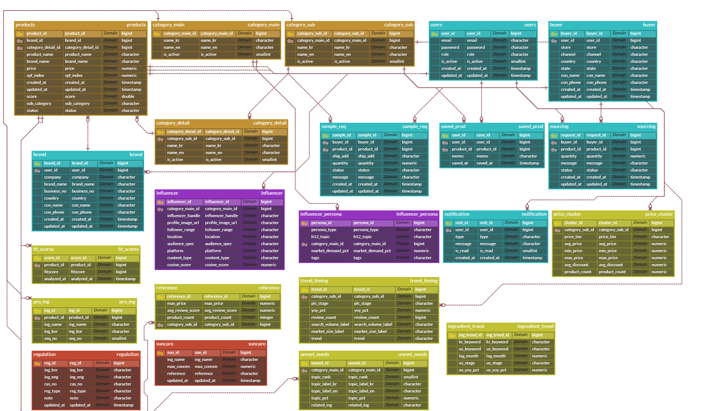
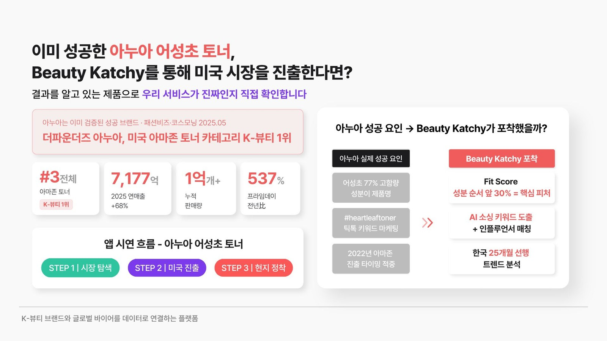
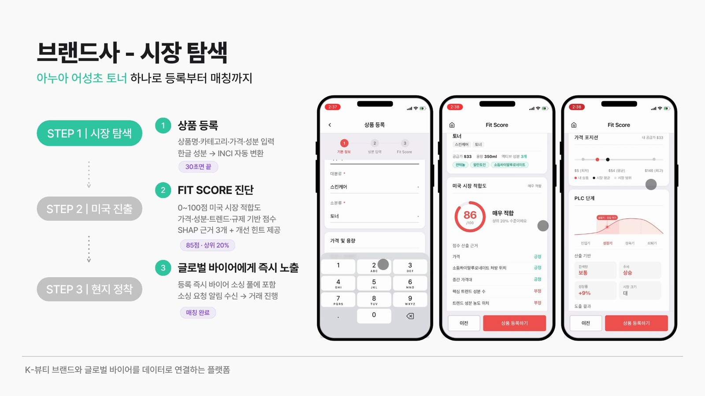
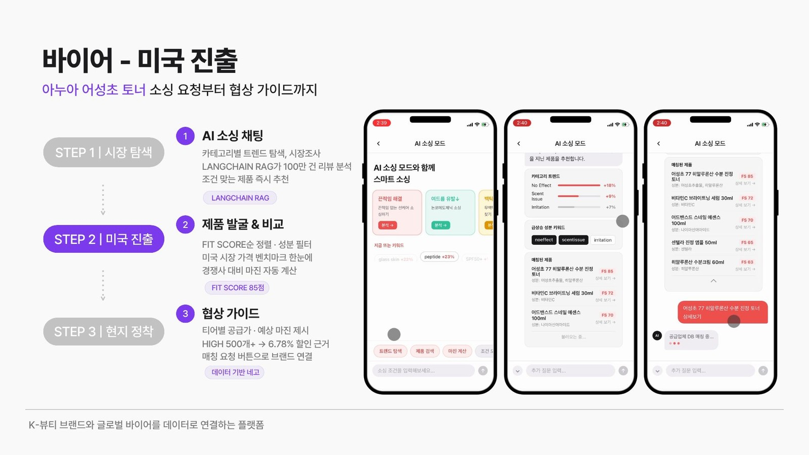
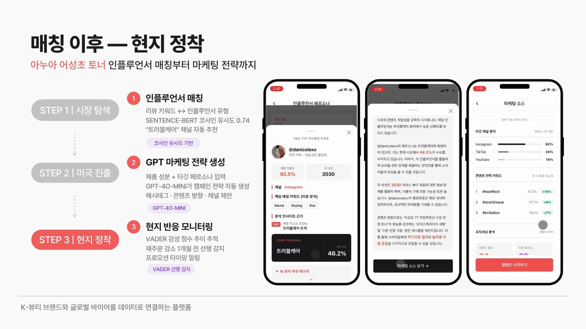

# Beauty Katchy

K-뷰티 브랜드와 글로벌 바이어를 데이터로 연결하는 AI 매칭 플랫폼 - Demo Day 최우수상 수상작

## 팀 프로젝트

아시아경제 AI 부트캠프 3차 프로젝트 · 5인 팀

- 원본 팀 레포: https://github.com/whdpdms2004-bot/finalteam4
- 본 레포는 포트폴리오용으로 최신 코드를 정리한 개인 레포이며, 팀 레포와 코드 상태가 다를 수 있습니다.

## 나의 역할

- 프로젝트 총괄 (기획·디자인·개발 전 과정 주도)
- React Native 프론트엔드 화면 구현
- **AI 서비스 3종 직접 구현** (Claude Code 활용) - AI 소싱 챗(스마트소싱), 마케팅 소스 생성, 인플루언서 매칭 AI 메시지. DA 팀원의 EDA 분석 결과(트렌드 선행성, 소비자 불만 데이터 등)를 입력으로 받아, API 연동·더미 데이터 설계·LLM(OpenAI) 연결·폴백 로직까지 실제 코드를 직접 작성했습니다.
- Fit Score(LightGBM + SHAP 기반 시장 적합도 예측) 모델 자체는 **팀원(ML 담당)이 구현**했습니다. 본인은 이 예측 결과를 서비스 흐름에 통합하는 부분을 담당했습니다.

## 기술 스택


| 영역 | 기술 |
|---|---|
| 프론트엔드 | React Native (Expo) |
| 백엔드 | FastAPI |
| DB | PostgreSQL (Supabase) |
| AI/RAG | LangChain + FAISS |
| LLM | OpenAI GPT-4o-mini |
| ML | LightGBM + SHAP (팀원 구현) |

## ERD



핵심 테이블 20개+ 기준 전체 스키마 설계.

## 핵심 기능

직접 구현한 AI 서비스 3종 (DA 팀원의 EDA 결과를 데이터로 활용, 로직·API 연동·LLM 연결은 본인 작성):

1. **AI 소싱 챗 (스마트소싱)** - LangChain RAG: `ingredient_trend` 테이블에서 동적으로 문서를 빌드하고 FAISS 유사도 검색(k=3)으로 컨텍스트를 구성. RAG 실패 시 OpenAI 직접 호출로, 그마저 실패하면 하드코딩 템플릿으로 3단 폴백 ([`backend/routers/buyer.py`](backend/routers/buyer.py))
2. **마케팅 소스 생성** - GPT-4o-mini API 호출, 인플루언서/상품 데이터를 프롬프트에 동적으로 주입하여 채널 분석·콘텐츠 전략·캠페인 메시지 생성 ([`backend/routers/buyer.py`](backend/routers/buyer.py))
3. **인플루언서 매칭 AI 메시지** - 매칭된 인플루언서·상품 데이터를 기반으로 GPT-4o-mini가 협업 추천 메시지 생성 ([`backend/routers/influencer.py`](backend/routers/influencer.py))

그 외 서비스 구성 요소:

- **Fit Score 진단** - LightGBM + SHAP 기반 미국 시장 적합도 예측. **팀원(ML 담당) 구현** ([`backend/predictor.py`](backend/predictor.py))

## 데모 영상

팀 백엔드(Railway/Supabase)가 종료되어 현재 API가 응답하지 않습니다. 실제 서비스 흐름은 아래 영상으로 확인하실 수 있습니다.

### 검증: 이미 성공한 제품으로 역검증



미국 아마존 토너 K-뷰티 1위 아누아 어성초 토너의 실제 성공 요인(성분명 전면 배치, 틱톡 키워드, 진출 타이밍)을 Fit Score·AI 소싱·트렌드 분석이 각각 포착하는지 대조 검증

### 서비스 흐름

1. 브랜드사 - 상품 등록(한글 성분→INCI 자동 변환), Fit Score 진단(LightGBM+SHAP), 바이어 소싱 풀 노출
[1. 브랜드사_데모 영상](https://drive.google.com/file/d/1rwb2ffiFch5wHM7zxNgwVebdu91-m96I/view?usp=drive_link)


2. 바이어 - AI 소싱 채팅(LangChain RAG, 100만 건 리뷰), Fit Score순 제품 비교, 데이터 기반 협상 가이드
[2. 바이어_데모 영상](https://drive.google.com/file/d/1B2Jw6CebcvdkG4gqh8qIuJGFB1lgOzLQ/view?usp=drive_link)


3. 매칭 이후 - 인플루언서 매칭(SENTENCE-BERT 코사인 유사도), GPT-4o-mini 마케팅 전략 생성, VADER 감성 추이 모니터링
[3. 매칭 이후_데모 영상](https://drive.google.com/file/d/1fHxJ7Knx4NgUG0kdX6zbk6uTddH2l6JU/view?usp=drive_link)


## 아키텍처

```
React Native (Expo)
        │  REST API
        ▼
   FastAPI (backend/)
   ├── routers/brand.py       상품 등록 · Fit Score 조회
   ├── routers/buyer.py       상품 탐색 · AI 소싱 챗 · 마케팅 소스
   ├── routers/influencer.py  인플루언서 매칭 AI 메시지
   ├── predictor.py           LightGBM + SHAP 추론
   └── database.py            SQLAlchemy 세션
        │                    │
        ▼                    ▼
PostgreSQL (Supabase)   OpenAI API (GPT-4o-mini)
                              ▲
                        LangChain + FAISS
                        (ingredient_trend RAG)
```

## 실행 방법

### 백엔드

```bash
cd backend
cp ../.env.example .env   # DATABASE_URL, OPENAI_API_KEY 입력
pip install -r requirements.txt
uvicorn main:app --reload
```

### 프론트엔드

```bash
npm install
npx expo start
```

> DB는 팀 공용 Supabase 인스턴스로, 현재 비활성화(프로젝트 종료)된 상태입니다. `.env`에 유효한 `DATABASE_URL`을 넣기 전까지는 DB 연동 API는 동작하지 않으며, `predictor.py` 단독 실행(모델 추론)은 DB 없이도 정상 동작합니다.
